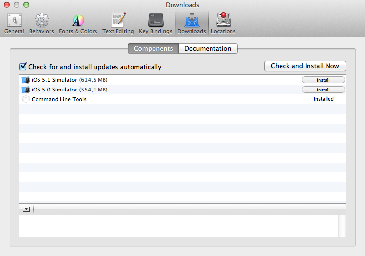
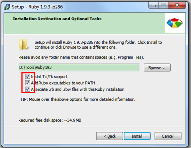

# Sass & Scss

## Chapter 1 简介

### 样式表预编译器

<ul class="hor_lst">
	<li>
		
	</li>
	<li>
		
	</li>
	<li>
		
	</li>
</ul>

<ul>
	<li>
		
	</li>
	<li>
		
	</li>
</ul>

传统意义上制作的工作流程

	开发者 编写 -> css样式表

而**样式表预编译器**则是在开发者和css样式表中间插入一层

	开发者 编写 -> 样式表预编译器（Sass,LESS,Stylus） 编译 -> css样式表

### 什么是Sass？背景？

Sass（Syntactically Awesome StyleSheets）是样式表预编译器，是Haml（HTML Abstract Markup Language）的副功能，Haml是为了防止标签没有闭合而开发的一种语言，类似于ruby，python的简洁语法结构。

### Sass与Scss的区别？

就是两种不同的语法结构。

Sass是前面提到的类似于ruby，python的简洁语法，采用缩进形式。

	$blue: #3bbfce
	$margin: 16px

	.content-nav
		border-color: $blue
		color: darken($blue, 9%)

	.border
		padding: $margin / 2
		margin: $margin
		border-color: $blue

Scss是CSS3的一个超集，采用CSS标准语法，使用大括号将样式的属性及属性值括起来。

	$blue: #3bbfce;
	$margin: 16px;

	.content-nav{
		border-color: $blue;
		color: darken($blue, 9%);
	}

	.border{
		padding: $margin / 2
		margin: $margin
		border-color: $blue
	}	

### 编辑器的选择

Sublime，koala，Codekit，WebStorm，etc。

### Sass的特性

变量，嵌套，mixin（@include，@extend），运算，控制语句（判断，循环）,function。

	
	
	

		<a href="http://localhost/tencent/kpi/home.html" target="_blank">Demo</a>
	

源代码：
<pre class="show_all_code">
<code>
/* 用户头像移动 */
@for $path_num from 0 through 66{
	@if($path_num == 0){
		.path_#{$path_num}{
			.user_pic{
				padding:17px 0;
			}
		}
	}
	@else{
		$path_row_num:ceil($path_num/4) - 1;
		.path_#{$path_num}{
			.user_pic{
				top: $path_row_num * 70 + 84px;
				@if($path_row_num % 2 == 0){
					left:percentage(abs($path_num/4 - ceil($path_num/4) + 3/4));
				}
				@else{
					right:percentage(abs($path_num/4 - ceil($path_num/4) + 3/4));
				}
			}
		}
	}
}
</code>
</pre>

## Chapter 2 安装

运行环境：

	1. ruby
	2. sass.gem
	3. gcc

#### Mac上的安装:

安装ruby前请先确认是否安装了gcc，如果安装了Xcode，请检查是否安装了command line tools，打开Xcode，在Xcode -> Preference -> Download下，查看“Command Line tools”这一项是否为“installed”。

如果不是installed，点击install安装或者下载[OSX-GCC-Installer](https://github.com/kennethreitz/osx-gcc-installer)来安装gcc，不然在安装ruby编译的时候会报误.

mac自带ruby环境，版本可通过 ruby -v 查看。如要更新ruby可以使用 gem update ruby或使用RVM(ruby包管理工具)。

因为ruby1.9.3已经自带gem，所以，通过gem install sass命令来安装sass。

使用 sass -v 命令查看sass版本，如出现版本信息，则安装成功。

#### Windows上的安装:

ruby的安装程序可以在 [rubyinstaller.org](http://rubyinstaller.org) 上下载得到。

双击ruby的安装程序，到下面的界面时全部勾选，然后点击install按钮直至安装完成。

sass的gem包可以在 [rubygems.org](http://rubygems.org/gem/sass) 上下载得到。

将下载好的sass的gem包拷贝到刚才安装好的ruby目录下的bin文件夹下，在命令行窗口中进入到这个目录，执行gem install sass。

使用 sass -v 命令查看sass版本，如出现版本信息，则安装成功。

## Chapter 3 基本用法

Scss默认输出的编码是UTF-8的，如果要修改编码，就必须在Scss文件中指定@charset。

Sass和Scss是可以互换的

	$ sass-convert path/style.sass path/style.scss
	$ sass-convert path/style.scss path/style.sass

将Scss文件转换成CSS文件

	$ scss --update path/style.scss:path/style.css

Scss提供了4种输出风格
	
	//嵌套方式，默认
	$ scss --update path/style.scss:path/style.css --style nested

	//每个样式的class和属性各占一行，适合开发环境
	$ scss --update path/style.scss:path/style.css --style expanded
	
	//每个样式各占一行，适合开发环境
	$ scss --update path/style.scss:path/style.css --style compact

	//压缩方式，适合线上发布环境使用
	$ scss --update path/style.scss:path/style.css --style compressed	

Scss源代码：

	#main {
		color: #fff;
		background-color: #000;
		p {
			width: 10em; 
		}
	}

	.huge {
		font-size: 10em;
		font-weight: bold;
		text-decoration: underline;
	}

:nested

	#main {
		color: #fff;
		background-color: #000; }
		#main p {
		width: 10em; }

	.huge {
		font-size: 10em;
		font-weight: bold;
		text-decoration: underline; }

:expanded

	#main {
		color: #fff;
		background-color: #000;
	}
	#main p {
		width: 10em;
	}

	.huge {
		font-size: 10em;
		font-weight: bold;
		text-decoration: underline;
	}

:compact

	#main { color: #fff; background-color: #000; }
	#main p { width: 10em; }

	.huge { font-size: 10em; font-weight: bold; text-decoration: underline; }

:compressed

	#main{color:#fff;background-color:#000;}#main p{width:10em;}.huge{font-size:10em;font-weight:bold;text-decoration:underline;}

Scss监视.scss文件

	//监视整个文件夹
	$ scss --watch scss_path:css_path

	//监视单个文件
	$ scss --watch scss_path/style.scss:css_path/style.css

ps:嫌麻烦的同学可以写个bat命令，每次双击就可以了，省去了敲代码的麻烦。

## Chapter 4 特性

### 4.1 变量

**变量的定义：**

$/^[A-Za-z_]+\w*/ : value，$$也是不行的。

	$width: 100px;

	$_name: facebook;

**变量的引用：**

	.test{ width: $width;}

	.ico_#{$_name}{ background: url("...");}

**变量的类型：**

1.数字（e.g. 2，3，10px）

2.有引号或者没有引号的文本字符（e.g. foo,"foo",'foo'）

3.色值（e.g. blue，#333，rgba(255,255,255,0.5)）

4.布尔型（e.g. true，false）

5.空（e.g. null）

6.列表值，用空格或逗号分隔（e.g. 3px solid #333, Arial, sans-serif）

7.sass 3.3.4中新增加一种数据类型map（e.g. $map:(key1:value1,key2,value2,key3:value3) ）

**变量可以做什么**

1.属性值

2.选择器名（有规律的选择器名）

3.进行运算

&nbsp;&nbsp;运算符号：+ - * / % == !=

&nbsp;&nbsp;3.1 运算注意事项

	$n = 3px; $m = 4pt; $n + $m; $m + $n;
	font: $n / $m;
	font: #{$n} / #{$m};

## Chapter 5 调试

传统的CSS（Scss）调试方法：

1.在浏览器中“审查元素”，查找需要修改的css。

2.复制class名，到css中查找，修改。（在Scss中查找位置）

3.回到浏览器中刷新查看效果。

4.用“审查元素”查看下一个需要修改的css。

5.复制class名，到css中查找，修改。（在Scss中查找位置）

		。

		。

		。
XX.修改完成，保存。

