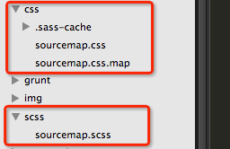
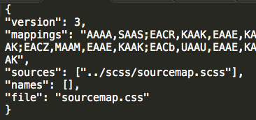
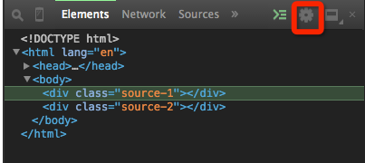
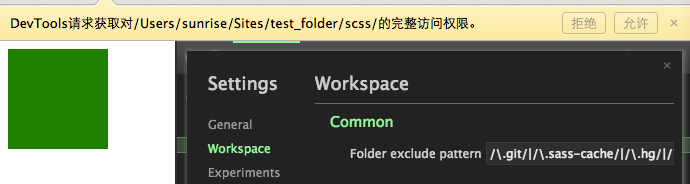
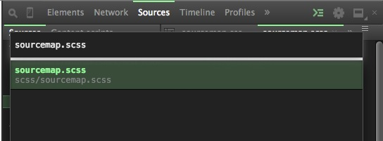

# Sass & Scss

## author: zEx zhang

## Chapter 1 简介

### 样式表预编译器

<ul class="hor_lst">
	<li>
		
	</li>
	<li>
		
	</li>
	<li>
		
	</li>
</ul>

<ul>
	<li>
		
	</li>
	<li>
		
	</li>
</ul>

传统意义上制作的工作流程

	开发者 编写 -> css样式表

而**样式表预编译器**则是在开发者和css样式表中间插入一层

	开发者 编写 -> 样式表预编译器（Sass,LESS,Stylus） 编译 -> css样式表

### 什么是Sass？背景？

Sass（Syntactically Awesome StyleSheets）是样式表预编译器，是Haml（HTML Abstract Markup Language）的副功能，Haml是为了防止标签没有闭合而开发的一种语言，类似于ruby，python的简洁语法结构。

### Sass与Scss的区别？

就是两种不同的语法结构。

Sass是前面提到的类似于ruby，python的简洁语法，采用缩进形式。

	$blue: #3bbfce
	$margin: 16px

	.content-nav
		border-color: $blue
		color: darken($blue, 9%)

	.border
		padding: $margin / 2
		margin: $margin
		border-color: $blue

Scss是CSS3的一个超集，采用CSS标准语法，使用大括号将样式的属性及属性值括起来。

	$blue: #3bbfce;
	$margin: 16px;

	.content-nav{
		border-color: $blue;
		color: darken($blue, 9%);
	}

	.border{
		padding: $margin / 2
		margin: $margin
		border-color: $blue
	}	

### 编辑器的选择

Sublime，koala，Codekit，WebStorm，etc。

### Sass的特性

变量，嵌套，mixin（@include，@extend），运算，控制语句（判断，循环）,function，@debug。

	
	
	

		<a href="http://localhost/tencent/kpi/home.html" target="_blank">Demo</a>
	

源代码：
<pre class="show_all_code">
<code>
/* 用户头像移动 */
@for $path_num from 0 through 66{
	@if($path_num == 0){
		.path_#{$path_num}{
			.user_pic{
				padding:17px 0;
			}
		}
	}
	@else{
		$path_row_num:ceil($path_num/4) - 1;
		.path_#{$path_num}{
			.user_pic{
				top: $path_row_num * 70 + 84px;
				@if($path_row_num % 2 == 0){
					left:percentage(abs($path_num/4 - ceil($path_num/4) + 3/4));
				}
				@else{
					right:percentage(abs($path_num/4 - ceil($path_num/4) + 3/4));
				}
			}
		}
	}
}
</code>
</pre>

## Chapter 2 安装

运行环境：

	1. ruby
	2. sass.gem
	3. gcc

#### Mac上的安装:

安装ruby前请先确认是否安装了gcc，如果安装了Xcode，请检查是否安装了command line tools，打开Xcode，在Xcode -> Preference -> Download下，查看“Command Line tools”这一项是否为“installed”。

如果不是installed，点击install安装或者下载[OSX-GCC-Installer](https://github.com/kennethreitz/osx-gcc-installer)来安装gcc，不然在安装ruby编译的时候会报误.

mac自带ruby环境，版本可通过 ruby -v 查看。如要更新ruby可以使用 gem update ruby或使用RVM(ruby包管理工具)。

因为ruby1.9.3已经自带gem，所以，通过gem install sass命令来安装sass。

使用 sass -v 命令查看sass版本，如出现版本信息，则安装成功。

#### Windows上的安装:

ruby的安装程序可以在 [rubyinstaller.org](http://rubyinstaller.org) 上下载得到。

双击ruby的安装程序，到下面的界面时全部勾选，然后点击install按钮直至安装完成。

sass的gem包可以在 [rubygems.org](http://rubygems.org/gem/sass) 上下载得到。

将下载好的sass的gem包拷贝到刚才安装好的ruby目录下的bin文件夹下，在命令行窗口中进入到这个目录，执行gem install sass。

使用 sass -v 命令查看sass版本，如出现版本信息，则安装成功。

使用Git repository来安装

	git clone git://github.com.nex3/sass.git

	cd sass

	rake install

通过淘宝RubyGems镜像安装sass

由于国内网络原因，导致rubygems.org存放在Amazon S3上面的资源文件间歇性连接失败。我们可以通过gem sources命令来配置源，先移除默认的 https://rubygems.org 源，然后添加淘宝的源 https://ruby.taobao.org ，然后查看当前使用的源是哪个，如果是淘宝的，就可以输入gem install sass来安装了，常用gem source命令可在下一页查看。

	$ gem sources --remove https://rubygems.org/
	$ gem sources -a https://ruby.taobao.org/
	$ gem sources -l
	*** CURRENT SOURCES ***

	https://ruby.taobao.org
	
	#如果是淘宝的地址，就可以直接gem install sass

常用gem source命令

	//显示当前使用的sources
	gem sources

	//添加一个source
	gem sources -a url地址

	//删除一个source
	gem sources -r url地址

	//更新source cache
	gem sources -u

sass版本升级命令：

	gem update sass

## Chapter 3 基本用法

Scss默认输出的编码是UTF-8的，如果要修改编码，就必须在Scss文件中指定@charset。

Sass和Scss是可以互换的

	$ sass-convert path/style.sass path/style.scss
	$ sass-convert path/style.scss path/style.sass

将Scss文件转换成CSS文件

	$ scss --update path/style.scss:path/style.css

Scss提供了4种输出风格
	
	//嵌套方式，默认
	$ scss --update path/style.scss:path/style.css --style nested

	//每个样式的class和属性各占一行，适合开发环境
	$ scss --update path/style.scss:path/style.css --style expanded
	
	//每个样式各占一行，适合开发环境
	$ scss --update path/style.scss:path/style.css --style compact

	//压缩方式，适合线上发布环境使用
	$ scss --update path/style.scss:path/style.css --style compressed	

Scss源代码：

	#main {
		color: #fff;
		background-color: #000;
		p {
			width: 10em; 
		}
	}

	.huge {
		font-size: 10em;
		font-weight: bold;
		text-decoration: underline;
	}

:nested

	#main {
		color: #fff;
		background-color: #000; }
		#main p {
			width: 10em; }

	.huge {
		font-size: 10em;
		font-weight: bold;
		text-decoration: underline; }

:expanded

	#main {
		color: #fff;
		background-color: #000;
	}
	#main p {
		width: 10em;
	}

	.huge {
		font-size: 10em;
		font-weight: bold;
		text-decoration: underline;
	}

:compact

	#main { color: #fff; background-color: #000; }
	#main p { width: 10em; }

	.huge { font-size: 10em; font-weight: bold; text-decoration: underline; }

:compressed

	#main{color:#fff;background-color:#000;}#main p{width:10em;}.huge{font-size:10em;font-weight:bold;text-decoration:underline;}

Scss监视.scss文件

	//监视整个文件夹
	$ scss --watch scss_path:css_path

	//监视单个文件
	$ scss --watch scss_path/style.scss:css_path/style.css

ps:嫌麻烦的同学可以写个bat命令，每次双击就可以了，省去了敲代码的麻烦。

## Chapter 4 特性

### 4.1 变量

**变量的定义：**

$/^[A-Za-z_]+\w*/ : value，$$也是不行的。

	$width: 100px;

	$_name: facebook;

**变量的引用：**

	.test{ width: $width;}

	.ico_#{$_name}{ background: url("...");}

**变量的类型：**

1.数字（e.g. 2，3，10px）

2.有引号或者没有引号的文本字符（e.g. foo,"foo",'foo'）

3.色值（e.g. blue，#333，rgba(255,255,255,0.5)）

4.布尔型（e.g. true，false）

5.空（e.g. null）

6.列表值，用空格或逗号分隔（e.g. 3px solid #333, Arial, sans-serif）

7.sass 3.3.4中新增加一种数据类型map(映射类型)（e.g. $map:(key1:value1,key2,value2,key3:value3) ）

**变量可以做什么**

1.属性值

2.选择器名（更适合有规律的选择器名）

3.进行运算

&nbsp;&nbsp;运算符号：+ - * / %

&nbsp;&nbsp;3.1 运算注意事项

	$n = 3px; $m = 4pt; $n + $m; $m + $n;
	font: $n / $m;
	font: #{$n} / #{$m};

**列表类型变量**

比如：
	
	$list: item1, item2, item3;
	$list: item1 item2 item3;
	$list: item1-1 item1-2 item1-3, item2-1 item2-2 item2-3;
	(看起来有些像数组)

**列表变量可以和function配合使用**

<a href="http://sass-lang.com/documentation/Sass/Script/Functions.html#length-instance_method">length($list)</a>

<a href="http://sass-lang.com/documentation/Sass/Script/Functions.html#nth-instance_method">nth($list,$index)</a>

<a href="http://sass-lang.com/documentation/Sass/Script/Functions.html#index-instance_method">index($list,$value)</a>

<a href="http://sass-lang.com/documentation/Sass/Script/Functions.html#append-instance_method">append($list,$value[,separator])</a>

<a href="http://sass-lang.com/documentation/Sass/Script/Functions.html#join-instance_method">join($list1,$list2[,separator])</a>

<a href="http://sass-lang.com/documentation/Sass/Script/Functions.html#zip-instance_method">zip($lists...)</a>

<a href="http://sass-lang.com/documentation/Sass/Script/Functions.html#list_separator-instance_method">list-separator(#list)</a>

@each $var in &lt;list&gt;

	@each $animal in puma, sea-slug, egret, salamander {
	  .#{$animal}-icon {
	    background-image: url('/images/#{$animal}.png');
	  }
	}

**map类型变量同样有封装好的function可以使用**

<a href="http://sass-lang.com/documentation/Sass/Script/Functions.html#map_get-instance_method">map-get($map, $key)</a>

<a href="http://sass-lang.com/documentation/Sass/Script/Functions.html#map_merge-instance_method">map-merge($map1, $map2)</a>

<a href="http://sass-lang.com/documentation/Sass/Script/Functions.html#map_remove-instance_method">map-remove($map, $key)</a>

<a href="http://sass-lang.com/documentation/Sass/Script/Functions.html#map_keys-instance_method">map-keys($map)</a>

<a href="http://sass-lang.com/documentation/Sass/Script/Functions.html#map_values-instance_method">map-value($map)</a>

<a href="http://sass-lang.com/documentation/Sass/Script/Functions.html#map_has_key-instance_method">map-has-key($map, $key)</a>

<a href="http://sass-lang.com/documentation/Sass/Script/Functions.html#keywords-instance_method">keywords($args)</a>

ps: map类型也可以嵌套，而且里面的值的类型可以不一样，即：

	$map: (
	  'this': 'is',             //string
	  'a': ('great', 'test'),   //list
	  'isn\'t it?': true,       //bool
	  'and this': 42,           //number
	  'and': ('also', 'this'),  //list
	  'nested': (
	    'map': 1337
	  )                         //map
	);

**简写参数列表**

$var_name...

e.g

	@mixin colors($text, $background, $border) {
		color: $text;
		background-color: $background;
		border-color: $border;
	}
	
	//list类型变量
	$values: #ff0000, #00ff00, #0000ff; 
	.primary {
		@include colors($values...);
	}
	
	//map类型变量
	$value-map: (text: #00ff00, background: #0000ff, border: #ff0000); 
	.secondary {
		@include colors($value-map...);
	}

**%foo**

占位符选择器（不属于变量）

它看起来像是类选择器或id选择器，除了将#或.替换成%。调用时使用@extend命令。

	#context a%extreme {
	  color: blue;
	  font-weight: bold;
	  font-size: 2em;
	}
	.notice {
	  @extend %extreme;
	}

编译完：

	#context a.notice {
	  color: blue;
	  font-weight: bold;
	  font-size: 2em;
	}

再看个例子：

	.test a%placeholder{
		color: #333;
	}
	.notice{
		@extend %placeholder;
		width: 10px;
	}
	.test-2{
		@extend .notice;
	}

编译完：
	
	.test a.notice, .test a.test-2{
		color: #333;
	}
	.notice, .test-2{
		width: 10px;
	}

** ps:%placeholder和	mixin的区别 **

通过上面我们发现，%placeholder和mixin都可以用@extend来调用，那两者的区别在哪里？

我们通过一个例子来看一下：

	%placeholder{
		width: 300px;
		.inner{
			width: 400px;
		}
	}

	@mixin mixin-test{
		width: 100px;
		.inner{
			width: 200px;
		}
	}

	.mixin-test{
		@extend mixin-test;
	}

	.placeholder{
		@extend %placeholder;
	}

编译后：

	.placeholder{
		width: 300px;
	}

	.placeholder .inner{
		width:  400px;
	}

	.mixin-test{
		width: 100px;
	}

	.mixin-test .inner{
		width: 200px;
	}

可以看出，%placeholder是将调用它的地方引到定义的地方替换并显示，而mixin却是在调用的地方将定义的样式块复制过来显示。

**!default和!optional**

***!default***

表示如果这个变量的值在其他地方没有被定义过，那么值就等于!default的值，被定义过则变成定义过的值

***!optional***

如果引用了一个不存在的class名或id，不加的话会报错。

看个例子：

	.test{
		@extend .test-2; //编译时报错
	}

	.test{
		@extend .test-2 !optional; //编译时不报错，不输出到生成的css中
	}

ps: !optional 要和前面的class名中间需要加空格。

**&选择器(父选择器)**

例子：

	a{
		color: #333;
		&:hover{
			color: #fff;
		}
	}

### 4.2 嵌套

省去了重复书写class和属性名公共部分。

	a{
		color: #333;
		span{
			font:{
				family: "Tohoma";
				size: 20px;
			}
		}
	}

编译后：

	a{
		color: #333;
	}
	a span{
		font-family: "Tohoma";
		font-size: 20px;
	}

### 4.3 @规则和指令

**目录**

@import

@media

@mixin

@extend

@include

@content

@function

@at-root

@debug

@warm

**@import**

和CSS的作用是一样的，将SCSS和SASS合并在一起输出CSS。

只是有几点需要注意：

&nbsp;&nbsp;&nbsp;&nbsp;1.文件的扩展名是.css。

&nbsp;&nbsp;&nbsp;&nbsp;2.文件名是以 http:// 开头的。

&nbsp;&nbsp;&nbsp;&nbsp;3.文件是用url()引入的。

&nbsp;&nbsp;&nbsp;&nbsp;4.如果import里有任何的媒体查询。

都只会编译后生成一个@import规则，而不会将里面的内容复制出来到生成的CSS中。

后缀是.scss或.sass的文件如果文件名是以_开头的，例如_reset.scss，在编译后不会出现，只会在不加_的scss中出现。

例如：

_reset.scss中的内容：

	*{
		margin: 0;
		padding: 0;
	}

style.scss中的内容：

	@import "_reset"

编译之后，只会生成style.css文件。

**@mixin**

最常使用的命令。相当于把一个样式块封装起来。

例子：
	@mixin dis-ib{
		display: inline-block;
		*display: inline;
		zoom: 1;
	}

usage:

	.dis-ib{
		@include dis-ib;
	}

	.dis-ib{
		@extend dis-ib;
	}

@mixin命令也可以带参数。

	@mixin icon($width: 15px,$height: 15px){
		width: $width;
		height: $height;
	}

usage:
	
	.ico{
		@include icon; //@include icon();
	}

or
	
	.ico{
		@include icon($width: 20px,$height: 20px);
	}

关于mixin的位置

	//正确 

	@mixin dis-ib{
		display: inline-block;
		*display: inline;
		zoom: 1;
	}

	.dis-ib{
		@include dis-ib;
	}

	
	//报错

	.dis-ib{
		@include dis-ib;
	}

	@mixin dis-ib{
		display: inline-block;
		*display: inline;
		zoom: 1;
	}

**@extend和@include**

相同：

&nbsp;&nbsp;&nbsp;&nbsp;这两个都是调用@mixin指令的命令。

不同：

&nbsp;&nbsp;&nbsp;&nbsp;@extend 会将所有使用@extend命令调用的@mixin内容提取出来。

&nbsp;&nbsp;&nbsp;&nbsp;@include 会将@mixin的内容放到当前调用的class或id中。

@extend例子：

	@mixin extend-example($font-color: #333){
		color: $font-color;
	}
	.test{
		@extend extend-example();
	}
	.test-2{
		@extend extend-example();
	}

编译后：

	.test, .test-2{
		color: #333;
	}

@include例子：

	@mixin extend-example($font-color: #333){
		color: $font-color;
	}
	.test{
		@include extend-example($font-color: #666);
	}
	.test-2{
		@include extend-example($font-color: #999);
	}

编译后：

	.test{
		color: #666;
	}
	.test-2{
		color: #999;
	}

**@content**

传递一个内容块到mixin命令中。

例子：

	@mixin tt{
		.wrapper{
			@content;
		}
	}

usage:

	@include tt{
		.tt-1{
			width: 10px;
		}
	}

result:
	
	.wrapper .tt-1{
		width: 10px;
	}

在内容块中变量的作用域

	$color: white;

	@mixin colors($color: blue){
		background-color: $color;
		@content;
		border-color: $color;
	}

	.colors{
		@include colors{
			color: $color;
		}
	}

result:

	.colors{
		background-color: blue;
		color: white;
		border-color: blue;
	}

**@function**

在sass中定义自己的function，在值或者脚本上下文中使用。

sass内置了很多function。可以参考：<a href="http://sass-lang.com/documentation/Sass/Script/Functions.html#opacity-instance_method">http://sass-lang.com/documentation/Sass/Script/Functions.html#opacity-instance_method</a>

例如：

	//左右结构
	$wrapWidth: 960px;
	$mainWidth: 700px;
	$space: 10px;

	@function sidebarWidth(){
		@return $wrapWidth - $mainWidth - $space;
	}
	
	.wrapper{
		width: $wrapWidth;
	}

	.main{
		width: $mainWidth;
	}

	.sidebar{
		width: sidebarWidth();
	}

**@at-root**

将@at-root命令包括的样式提出到最外层。

例子：

	.parent{
		width: 10px;
		.parent-2{
			width: 20px;
			@at-root{
				.child-1{
					width: 30px;
				}
			}
		}
	}

result:

	.parent{
		width: 10px;
	}
	.parent .parent-2{
		width: 20px;
	}
	.child-1{
		width: 30px;
	}

@at-root在实际中的应用可以参考：

<a href="http://www.w3cplus.com/preprocessor/Sass-3-3-new-feature-at-root-bem.html">http://www.w3cplus.com/preprocessor/Sass-3-3-new-feature-at-root-bem.html</a>

文章中的应用是css的class使用BEM方式命名。

### 4.4 控制命令

@if

@for

@each

@while

**@if指令**

例子：

	$type: monster;
	p {
	  @if $type == ocean {
	    color: blue;
	  }
	  @else if $type == monster {
	    color: green;
	  }
	  @else {
	    color: black;
	  }
	}

**@for指令**

语法：

@for $var from &lt;start&gt; through &lt;end&gt;

@for $var from &lt;start&gt; to &lt;end&gt;

例子：

	@for $i from 1 through 3 {
	  .item-#{$i} { width: 2em * $i; }
	}

result:
	
	.item-1{
		width: 2em;
	}

	.item-2{
		width: 4em;
	}

	.item-3{
		width: 6em;
	}

3.3版本后新添加了from ... to

	@for $i from 1 to 3 {
	  .item-#{$i} { width: 2em * $i; }
	}

result:
	
	.item-1{
		width: 2em;
	}

	.item-2{
		width: 4em;
	}

**@each指令**

语法：

@each $var in &lt;list or map&gt;

例子：

	@each $animal in puma, sea-slug, egret, salamander {
	  .#{$animal}-icon {
	    background-image: url('/images/#{$animal}.png');
	  }
	}

result:
	
	.puma-icon {
	  background-image: url('/images/puma.png'); }
	.sea-slug-icon {
	  background-image: url('/images/sea-slug.png'); }
	.egret-icon {
	  background-image: url('/images/egret.png'); }
	.salamander-icon {
	  background-image: url('/images/salamander.png'); }

也可以传递多个参数

	@each $animal, $color, $cursor in (puma, black, default),
                                  (sea-slug, blue, pointer),
                                  (egret, white, move) {
	  .#{$animal}-icon {
	    background-image: url('/images/#{$animal}.png');
	    border: 2px solid $color;
	    cursor: $cursor;
	  }
	}

result：
	
	.puma-icon {
	  background-image: url('/images/puma.png');
	  border: 2px solid black;
	  cursor: default; }
	.sea-slug-icon {
	  background-image: url('/images/sea-slug.png');
	  border: 2px solid blue;
	  cursor: pointer; }
	.egret-icon {
	  background-image: url('/images/egret.png');
	  border: 2px solid white;
	  cursor: move; }

因为新版sass中增加了map类型，所以上面的传递多个参数也可以这样写。

	@each $header, $size in (h1: 2em, h2: 1.5em, h3: 1.2em) {
	  #{$header} {
	    font-size: $size;
	  }
	}

result：
	
	h1 {
	  font-size: 2em; }
	h2 {
	  font-size: 1.5em; }
	h3 {
	  font-size: 1.2em; }

**@while指令**

例子：

	$i: 6;
	@while $i > 0 {
	  .item-#{$i} { width: 2em * $i; }
	  $i: $i - 2;
	}

result：

	.item-6 {
	  width: 12em; }

	.item-4 {
	  width: 8em; }

	.item-2 {
	  width: 4em; }

## Chapter 5 调试

传统的CSS（Scss）调试方法：

1.在浏览器中“审查元素”，查找需要修改的css。

2.复制class名，到css中查找，修改。（在Scss中查找位置）

3.回到浏览器中刷新查看效果。

4.用“审查元素”查看下一个需要修改的css。

5.复制class名，到css中查找，修改。（在Scss中查找位置）

+ 。

+ 。

+ 。

XX.修改完成，保存

不用切来切去，一个界面修改scss

### 需要的环境

·Sass的版本：sass3.3+

&nbsp;&nbsp;&nbsp;&nbsp;·sass -v //查看sass版本

&nbsp;&nbsp;&nbsp;&nbsp;·gem update sass //升级到最新版

&nbsp;&nbsp;&nbsp;&nbsp;·gem install sass –v ‘>=3.3.0alpha’

&nbsp;&nbsp;&nbsp;&nbsp;//安装某一版本的sass

chrome canary 版本

https://www.google.com/intl/en/chrome/browser/canary.html

(现在可以不用canary版本的chrome，最新版已经支持scss的debug，下面也以最新版讲解)

### 配置Sass

	scss –sourcemap=TYPE path/style.scss path/style.css

	/*
		好像只有最新版的sass才需要加type
		type: 
		1.atuo(默认) 相对路径
	    2.file 绝对路径
	    3.inline 包含在源文本中的sourcemap
	    4.none 忽略sourcemap
	*/

·如果想要修改scss后自动保存成css，可以使用-watch命令

	scss –sourcemap=TYPE –watch path/style.scss:path/style.css

如果顺利的话，你会在css文件的最后一行看到下面的一行字符

同时你会在css同级目录下看到.map文件，这个文件是用来将scss和css进行关联的文件

<table>
	<tr>
		<td>
			
		</td>
		<td>
			
		</td>
	</tr>
</table>

### 在chrome中开启sourcemap

在chrome中右键然后选择审查元素，或者按F12开启DevTools。

然后点击齿轮icon。

在打开的settings面板中，选择“Enable CSS Source maps”及下面的选项。

### 建立workspace

·在workspace选项卡中选择文件夹（存放scss的文件夹）

chrome会询问你是否允许DevTools获取文件夹权限，选择“允许”。

### 创建文件的对应表

在sources选项卡下可以看到线上地址和刚才加的workspace。

在线上地址下的scss文件夹下，右键scss文件，选择map to file system resource，然后和本地的scss对应。

<table>
	<tr>
		<td></td>
		<td></td>
	</tr>
</table>

然后会弹出一个对话框，告诉你需要重启inspector，点击确定后会自己重启。

### 配置完成

·经过上面的步骤完成配置，就可以在浏览器中进行修改并查看修改效果，并且在浏览器中的修改会直接改变scss文件，如果命令中使用了—watch，那么css文件也会同步进行更新。

·对于scss中@import的样式同样管用，浏览器会自己找到包含的scss文件，然后修改即可。

·对于属性值，按command+鼠标（mac）单击可以进入source选项卡进行修改，修改后刷新页面就可以看到效果。

### END