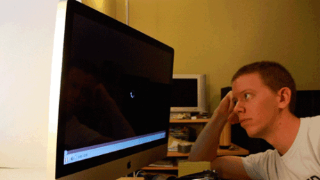
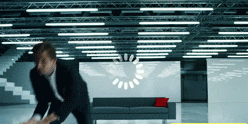
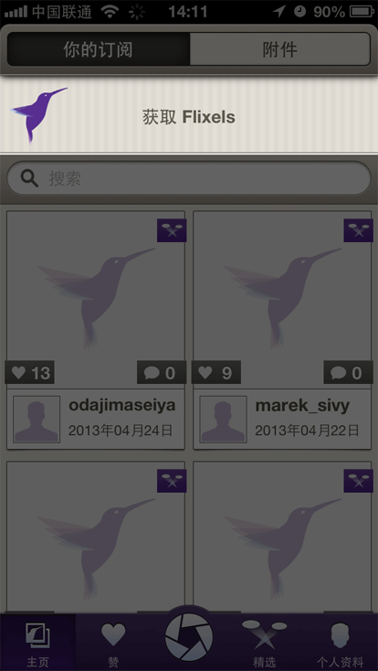
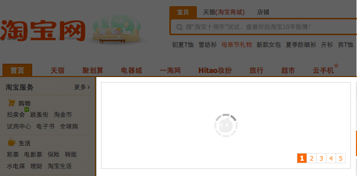
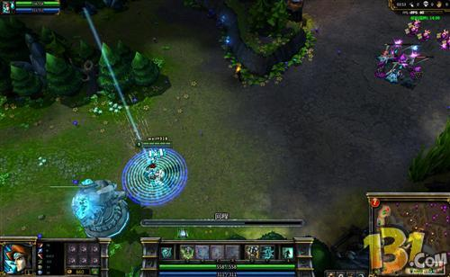
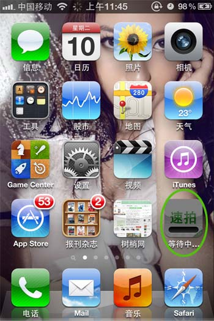

等待会让人产生焦躁的情绪，比如过了约好的时间但对方还没有到，5分钟后可能就会不厌其烦的打电话询问迟到的人会是什么时间到，在网站上这种情绪会更加突出，据研究表明网站上用户最长的等待时间在4～6秒。

虽然现在运用各种技术使等待时间变的尽可能短，但有时也会出现等待时间较长的情况，比如网速慢，异步加载数据比较大时，都会出现。

现在404页面设计丰富多彩，在出错后尽量把用户留在自己网站中，但有的用户是在失去耐心的情况下离开网站的，我们要如何延长用户的等待时间，如何才能在用户等待的时间里尽量降低这种负面情绪呢，我们先来看看大部分网站现在的做法（图1）：

看到这个图标，你心里在想什么？“这个网站好慢啊”，“能不能别转了，转你妹啊”。。。，恨不得像下图一样

根据以往的交互经验，用这个图标没有错，用户可以不经过思考就知道这是等待的意思，同样，用户也会条件反射的产生不耐烦，急躁的情绪。我们想要这种效果吗？

对于产品，我们是想要用户在轻松愉快的环境下使用，让用户在使用中发现一些小彩蛋会让用户惊喜，增加对网站的好感和宽容度。

那么回到正题，看过了网站在用户等待时的传统展现做法后我要怎么改进呢，我总结了3种，当作抛砖引玉，期待大家更好的想法。

1.加强网站的品牌整体性，主要是网站logo演化成的loading图，在移动端很多产品都有应用，比如flixel（图2），在web端，淘宝（图3）做的也很不错，增强了用户对淘公仔的印象。

(图2)

(图3)

2.增加网站的娱乐性，让用户在等待中会心一笑，比如图4。

和我一起边等边做操吧

(图4)

3.进度条，用户对等待时间有预期，也会减少烦躁感。 
   在游戏界面经常能见到进度条的loading图（图5），用户通过进度可以大概预测出还要有多长的等待时间。
   

   
(图5)

   苹果app下载也采取进度条形式（图6），对于完成下载有积极作用。
   

   
(图6)

